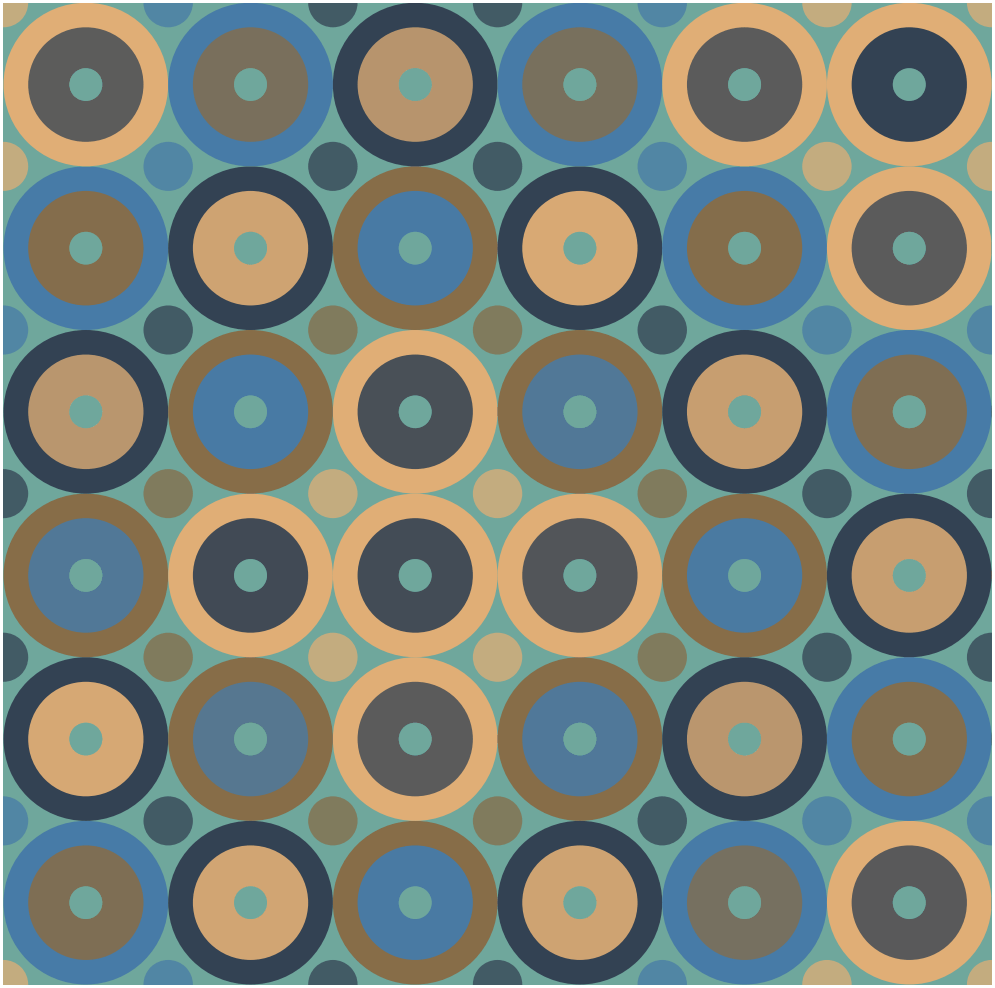
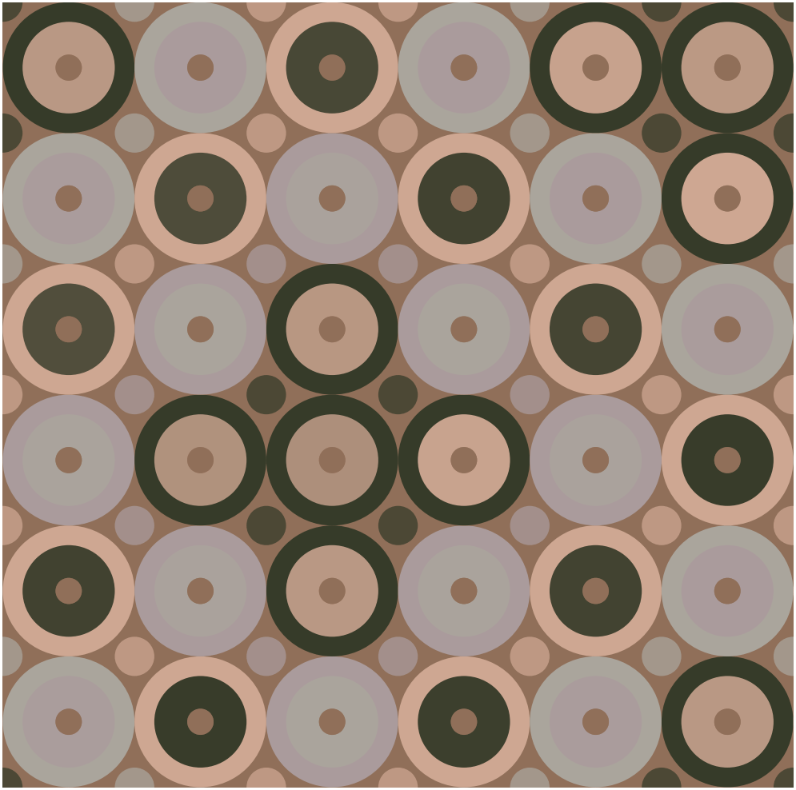

# Slide

Slide is a script/program?? I wrote that checks to see the song that is currently playing in Spotify (I removed the iTunes implementation because I don't use iTunes).

Once I know the song that is playing, the script searches the iTunes store for the album art relating to that song using the artist name and the song name to narrow it down. 

I then save the album art to be able to get the dominant color and the color palette of the album art. ColorThief returns the color palette as an array of tuples but that doesn't fit my needs so I convert the RGB tuples into hex code format. 

After that, we generate a patterned gif. I actually don't how this part works. I used this project to generate the pattern: https://github.com/eleanorlutz/AnimatedPythonPatterns

I curerntly have the DPI of each GIF set to 300. Obviously this results in huge GIF files but feel free to change it to your liking. Just find and search for "dpi" and change the values.

Processing time might take a while so give it some time.

## How to run

**Open Spotify and play something.**
**You need Python 2.7 or Python 3 and PIP**. You can figure out how to install those on your own.
``` shell
git clone https://github.com/fadelakin/slide.git
cd slide
pip install -r requirements.txt
python track.py
```

## Pattern examples

Slide by Calvin Harris, Frank Ocean, Migos


XO TOUR Llif3 by Lil Uzi Vert


Signs by Drake


Crazy by Thief


The Good Life by Kanye West


Magnolia by Playboi Carti


El Ratico by Juanes


### TODO:
- refactor code
- integrate spotify for automatic playing detection (would run as a daemon and need a way to reduce filesize)
